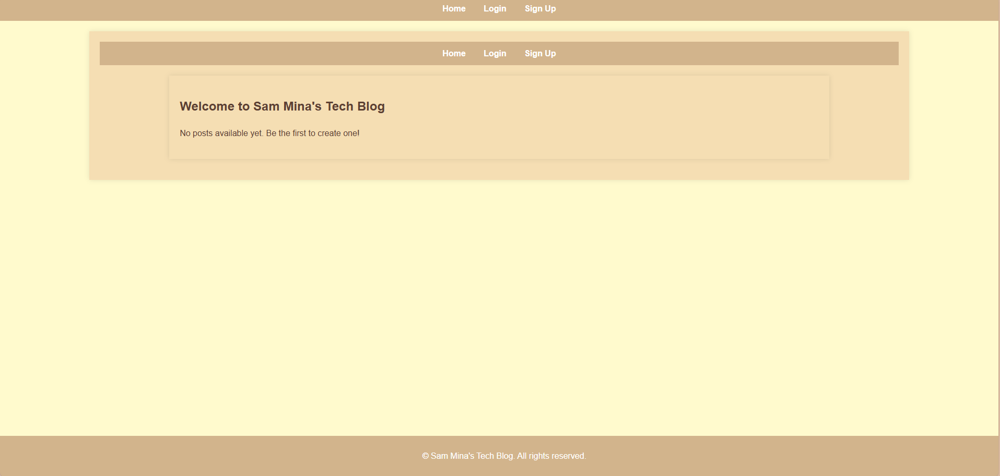
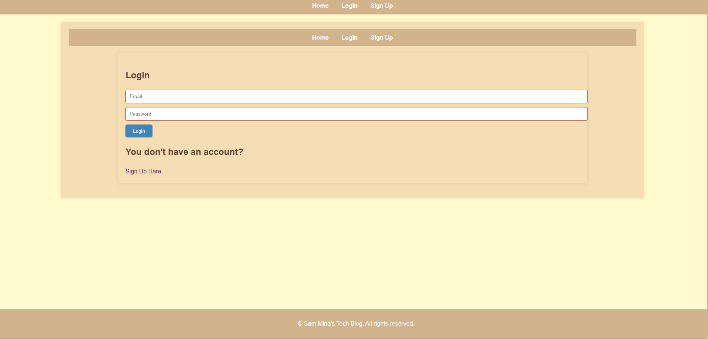
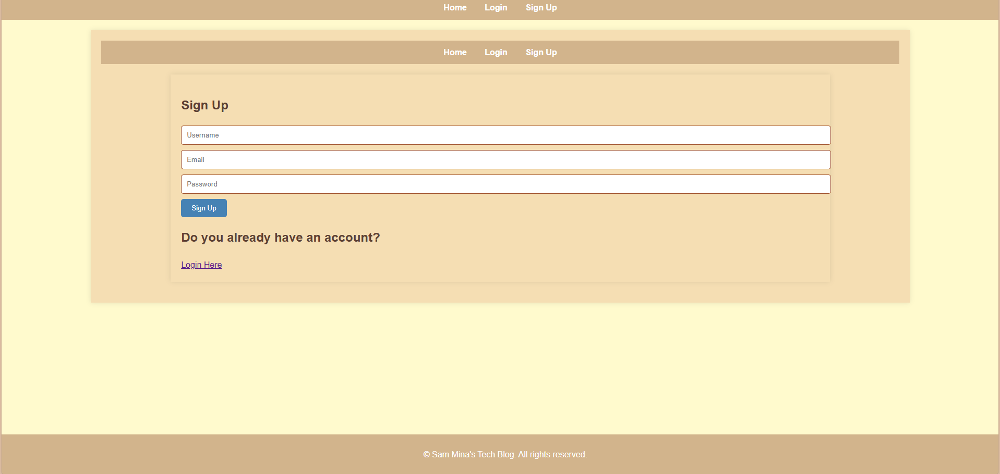

# Tech Blog

## Description
A CMS-style blog where developers can publish posts and comment on other's posts.

## Table of Contents
- [Website](#website)  
- [Usage](#usage)  
- [License](#license) 
- [Contributing](#contributing)  
- [Tests](#tests)  
- [Questions](#questions)

## Website URL
[Sam Mina's Tech Blog ](https://tech-blog-latw.onrender.com/)

## Usage
This app uses a Model-View-Controller paradigm. It implements Handlebars.js for Views and uses the pg and Sequelize packages to connect to Posgres for the Models. It creates an Express.js API for the Controllers.

## License
This project is licensed under the None license.

## Contributing
Postgres database hosted on Render

## Tests
Open on integrated terminal and install dependencies. Log into postgres and create database. Exit back into terminal and seed the data. Then start the server.

## Questions
If you have any questions, please contact me at [samandmissy2010@gmail.com](mailto:samandmissy2010@gmail.com).
You can also find more of my work on my [GitHub profile](https://github.com/Sam-Mina-engineer).

